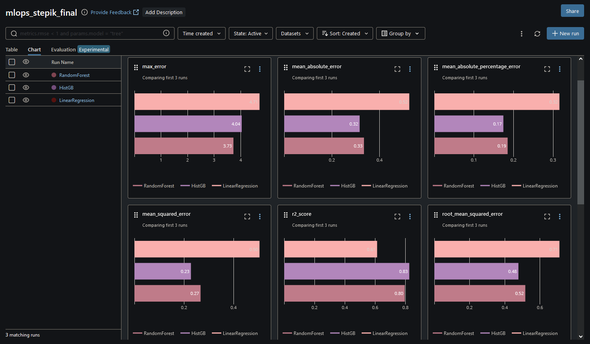

# Intro to MLOps

Final work for the [MLOps.Inception](https://stepik.org/course/181476/syllabus) course, provided by HSE university.

The goal was to write a DAG that trains 3 different regressor models and stores its code and metrics in a MLflow experiment.

The DAG:
* Retrieves data (California Housing) from locally-running PostgreSQL server, and stores it into S3
* Retrieves data from S3 and runs preprocessing. The results are also stored into S3
* Initializes the MLflow experiment, providing experiment id to be used for training tasks
* Runs 3 model training tasks in parallel, logging the model and storing regressor metrics into MLflow
* Saves timestamps of the tasks into S3 

DAG graph:

MLflow metrics of all models:

Metadata of one of the models - HistGB:

Code for the DAG is available [here]()
